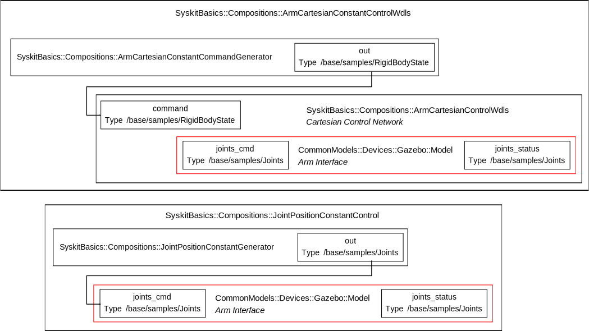

# Profiles and Devices
{:.no_toc}

**Where are we ?** So far, we have a control composition. But as we noticed
when we created [the arm control network](composition.html), it is not using a
real component as the arm, only a device model. This page will be talking about
devices, and telling how one replaces the device model by something that can be
run.

There are no pages in blue this time … the purpose of this page will be to
replace the Model device (in red) by the actual device ... but first to learn
about devices themselves.

{: .fullwidth}

- TOC
{:toc}

One can partition a component network into three categories:

- source of data
- sinks of data
- transformation of data

Within a robotic system, the source and sinks of data are the sensors and
actuators of the robot itself. What makes them unique when building the system's
component network is that they are indeed _unique_.

While the data processing components can easily be duplicated - an image
preprocessing component can be instantiated multiple times to process multiple
streams of data - one cannot duplicate devices.  They are bound to hardware,
and we still don't know how to grow new devices on the robot on-demand.

This difference shows up in the Syskit modelling system. Devices
are defined separately within a _robot interface_. We will now see how this is done, and
how we can use these devices within our arm control network, binding the
simulated arm with the control network.

## Defining devices for the Gazebo system

A robot definition is created within a Syskit _profile_. Profiles are the models
that bind network definitions (compositions) with devices and other
compositions. It's also where the robot definition happens.  
By convention, one usually creates a per-robot `Base` profile that
contains the robot definition.  Let's do that now.

~~~
$ syskit gen profile -rgazebo base
      create  models/profiles/gazebo
      create  models/profiles/gazebo/base.rb
      create  test/profiles/gazebo
      create  test/profiles/gazebo/test_base.rb
~~~

Note how the addition of `-rgazebo` to the command line ensured that the model
is generated within the `gazebo/` subdirectory of the `profiles/` folder and
within the `Gazebo` namespace of `Profiles`. This is a general convention (e.g.
compositions specific to our `gazebo` robot would be in `compositions/gazebo/` and
within the `Compositions::Gazebo` namespace.
{: .callout .callout-warning}

Now, here's the catch: we will actually not really learn to define devices, since
the mapping from the simulation model to devices is done automatically from the
robot model. One only has to declare the robot model in the `Base` profile:

~~~ruby
module SyskitBasics
  module Profiles
    module Gazebo
      profile 'Base' do
        use_gazebo_model 'model://ur10',
          prefix_device_with_name: true
        use_sdf_world
      end
    end
  end
end
~~~

**Note** the `prefix_device_with_name` argument is here for backward
compatibility reasons. Syskit will issue a deprecation warning if you forget
it.
{: .note}

And have a look at the generated devices with `syskit ide -rgazebo models/profiles/gazebo/base.rb`:

{: .fullwidth}

One can see that there is one device definition per link in the model, and one
for the model itself. Let's click on the model and have a look at the **Dataflow** section.
Enable both "Show all ports" and "Show task info" to get port information .

{: .fullwidth}

## Injecting the device into the arm control network {#profile_define}

As said, profiles is where this kind of injection is done. But let's keep `Base`
for really low-level stuff like devices. Let's create an `ArmControl` profile to
integrate the arm control stuff.

~~~
syskit gen profile -rgazebo ArmControl
~~~

We need to require the `Base` profile and `ArmCartesianControlWdls` composition
definition.  Then, `define` the cartesian and joint position controls _for our
UR10 robot in gazebo_ by injecting the UR10 device as the 'arm' child of the
composition.

The model name given to `define` in a profile is made out of a [demeter
chain](https://martinfowler.com/bliki/FluentInterface.html). In Ruby, this is usually
done by breaking each method call with a newline, leaving a trailing dot on the
previous line. Don't forget these dots !
{: .callout .callout-warning}

~~~ruby
require 'syskit_basics/models/profiles/gazebo/base'
require 'syskit_basics/models/compositions/arm_cartesian_constant_control_wdls'
require 'syskit_basics/models/compositions/joint_position_constant_control'

module SyskitBasics
  module Profiles
    module Gazebo
      profile 'ArmControl' do
        define 'arm_cartesian_constant_control',
          Compositions::ArmCartesianConstantControlWdls.
            use(Base.ur10_dev)
        define 'arm_joint_position_constant_control',
          Compositions::JointPositionConstantControl.
            use(Base.ur10_dev)
      end
    end
  end
end
~~~

As we mentioned [when we defined it](constant_generator.html#joint_position_constant_generator),
the joint position constant control has been defined with the goal of providing a sane default
position. Let's make sure this is available easily by creating a definition with a default
setpoint. This will reuse the `arm_joint_position_constant_control` definition, which is accessed
with the `_def` suffix. Usable joint positions can be found using the `rock-roboviz` tool:

~~~
$ rock-roboviz model://ur10
~~~

~~~ruby
require 'syskit_basics/models/profiles/gazebo/base'
require 'syskit_basics/models/compositions/arm_cartesian_constant_control_wdls'
require 'syskit_basics/models/compositions/joint_position_constant_control'

module SyskitBasics
  module Profiles
    module Gazebo
      UR10_SAFE_POSITION = Hash[
        'ur10::shoulder_pan'  => 0,
        'ur10::shoulder_lift' => -Math::PI/2,
        'ur10::elbow'         => Math::PI/2,
        'ur10::wrist_1'       => 0,
        'ur10::wrist_2'       => 0,
        'ur10::wrist_3'       => 0]

      profile 'ArmControl' do
        define 'arm_cartesian_constant_control',
          Compositions::ArmCartesianConstantControlWdls.
            use(Base.ur10_dev)
        define 'arm_joint_position_constant_control',
          Compositions::JointPositionConstantControl.
            use(Base.ur10_dev)
        define 'arm_safe_position',
          arm_joint_position_constant_control_def.
            with_arguments(setpoint: UR10_SAFE_POSITION)
      end
    end
  end
end
~~~
{: .dependency_injection}

A device model is accessed using the device's name with a `_dev` suffix on the
profile it is defined. Here `Base.ur10_dev` is the `ur10` device
defined on the robot definition in `Base`.
{: .callout .callout-info}

**Note** when building profiles, the require lines as well as the names of
models and roles that can be used in the `use` statement can easily be browsed
using the IDE
{: .callout .callout-info}

Let's have a look at the final `arm_cartesian_constant_control` definition.

{: .fullwidth}

**Next**: we're almost there, just need now to map the components to actual processes,
[a.k.a. deploy the network](deployment.html)
{: .next-page}
