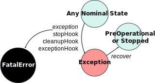

# Lifecycle State Machine
{:.no_toc}

- TOC
{:toc}

While the component interface tells how to _communicate_ with a component, the
lifecycle state machine defines how a component can be controlled at runtime.
All Rock components share the same state machine, which is what allows [the
generic Syskit integration](../runtime_overview/event_loop.html).

## The nominal RTT state machine

What follows is the **nominal** state machine. On each state
transition, the italic names are the transition names, and the non-italic name
the name of the method that will be called on the component so that it does
something, i.e. the ones that you -- the component developer -- must implement
if something is needed for a particular transition.

The `configureHook()` and `startHook()` methods may return false, in which case
the transition is refused.

{: .fullwidth}

### Configure and Start

As its name implies, the transition between PreOperational and Stopped is meant
to encapsulate the need for complex and/or costly configuration. For instance,
trying to open and configure a device (which can take very long). To give you
another example, in hard realtime contexts, it is expected that `startHook()` is
hard realtime while `configureHook()` does not need to be.

Additionally, because of [assumptions within Syskit](../basics/recap.html), the
`configureHook()` is the only place where dynamic ports can be created (and
`cleanupHook()` the place where they must be destroyed).

**Note** the `needs_configuration` statement within the file generated by
`rock-create-orogen` allowed to control whether the component's requires a
`configure` step or not. This is still here for historical reasons. All new
components should have it.
{: .important}

## Error representation

 
{: .pull-left}

Errors are represented in the way depicted on the left. The exception state is
used to represent errors that demand the component to stop, but can be recovered
from by restarting it. The fatal error state, however, is a terminal state:
there is no way to get out of it except by restarting the component's process.

The components will automatically transition from any state to Exception if a
C++ exception is "leaked" by one of the hooks (i.e. uncaught exception).
Because of such a transition, the stopHook and cleanupHook will be called
before getting into Exception. In addition, one may transition manually to
the exception state by calling `exception()` from within the code. Note that
`exception()` behaves as a normal function, i.e. will not interrupt the flow
of the method it is in. Make sure you return after the exception:

~~~
void Task::updateHook()
{
  if (something_went_wrong)
    return exception();

  // Without the 'return', the execution would continue as if everything was
  // alright
}
~~~

If, while going into Exception, another C++ exception is caught, the component
will go into Fatal. In general, there should be no reason to transition to
fatal manually.

## Extending the state machine {#extended_states}

oroGen offers a way to have a more fine-grained reporting mechanism for
components to their coordination layer. This mechanism is based
on the definition of sub-states for each of the runtime and terminal states of
the task context state machine: Running, Exception and Fatal.

These sub-states are declared in the <tt>task_context</tt> block of the oroGen
specification:

~~~ ruby
task_context "MotionTask" do
  # Sub-states of Running (nominal operations)
  runtime_states 'GOING_FORWARD', 'TURNING_LEFT'
  # Sub-states of Exception (non-nominal end)
  exception_states 'BLOCKED', 'SLIPPING'
  # Sub-states of Fatal (not recoverable error)
  fatal_states 'TOTALLY_BROKEN'
end
~~~

On the C++ side, this mechanism is available through two things:

* a States enumeration that defines all the states in a manner that is usable in
  the code
* the `state(States)`, `exception(States)` and `fatal(States)` methods that
  allow to declare state changes in the C++ code.

For instance, if the updateHook() detects that the system is blocked, it would
do

~~~ cpp
void MotionTask::updateHook()
{
    // code
    if (blocked)
    {
        exception(BLOCKED);
        return;
    }
    // code
}
~~~

All these generate notifications can be reacted on at the Syskit level to change
the system's behavior. Because each of these calls generate a notification, it is
good practice to avoid transitioning multiple time to the same runtime state. Calls
to `state()` can be guarded to avoid this:

~~~ cpp
if (state() != GOING_FORWARD)
  state(GOING_FORWARD);
~~~

**Next**: let's see how one should [write the `*Hook` methods](writing_the_hooks.html).
{: .next-page}
