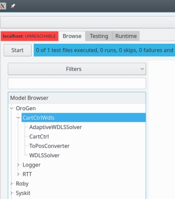
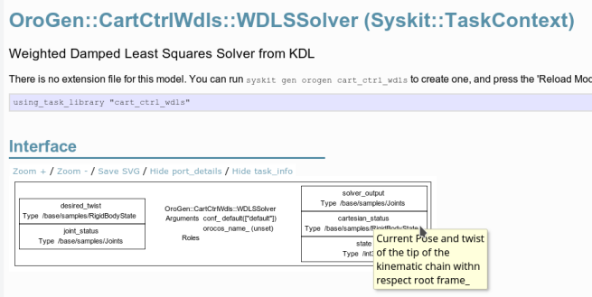
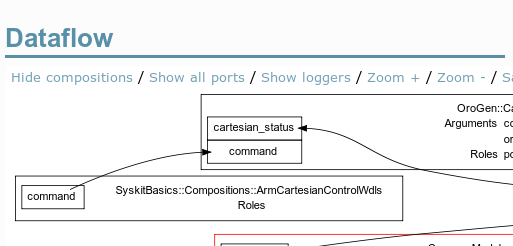

# Compositions: designing the network for the cartesian control of an arm

We are now going to try and do simple control [of our simulated
arm](getting_started.html). We are going to do the integration of the control
components and UR10 arm on Gazebo from scratch. However, we are going to see
later than Syskit allows to make this integration generic, so that it can be
reused.

In Syskit, one has to _declare_ how components must be connected together to
form a function, and then can request the system to actually run that function.

This page deals with the first step (design). The [next page](constant_generator.html) will create the command generator, and we will then [_deploy_ the network](deployment.html) and run it.

But let's not get too ahead of ourselves, and install the control package that
will implement the control.

## Installing the necessary packages {#add_package}

Packages in Rock are defined within _package sets_. These package sets define
both how to build the package and where it should be downloaded from. The
default installation imports at least the `rock.core` and the
`rock` package sets (see the `package_sets` section in `autoproj/manifest`). The
latter is the one where the control packages are defined.

<a class="btn btn-warning" role="button" data-toggle="collapse" href="#autoproj_show" aria-expanded="false" aria-controls="autoproj_show">
  Advanced
</a>Finding more about a package using `autoproj show`

Use `autoproj show` to find more about a given package. For `cart_ctrl_wdls`, this gives:

~~~
$ autoproj show cart_ctrl_wdls
source package control/orogen/cart_ctrl_wdls
this package is not checked out yet, the dependency information will probably be incomplete
source definition
  WARN: control/orogen/cart_ctrl_wdls from rock does not have a manifest
	type: git
	url: https://github.com/rock-control/control-orogen-cart_ctrl_wdls.git
	branch: master
	interactive: false
	push_to: git@github.com:/rock-control/control-orogen-cart_ctrl_wdls.git
	repository_id: github:/rock-control/control-orogen-cart_ctrl_wdls.git
	retry_count: 10
	first match: in rock (/home/doudou/dev/vanilla/rock-website/autoproj/remotes/rock/source.yml)
		branch: $ROCK_BRANCH
		github: rock-control/control-$PACKAGE_BASENAME
	overriden in rock (/home/doudou/dev/vanilla/rock-website/autoproj/remotes/rock/source.yml)
		branch: $ROCK_BRANCH
		github: rock-control/control-orogen-$PACKAGE_BASENAME
	is not directly selected by the manifest
~~~

The "first match" line is always the package set where the package is defined. In this case, the
`rock` package set, which is checked out in `autoproj/remotes/rock/`

To install the package, add it in the `layout` section of your manifest:

~~~yaml
layout:
  - rock.core
  - rock.gazebo
  - control/orogen/cart_ctrl_wdls
~~~

Then, run the following to checkout missing packages but avoid updating the existing ones:

~~~
aup --checkout-only --all
~~~

And finally build and install

~~~
amake --all
~~~

## Binding the components together {#composition}

Compositions declare groups of components and connects them together. In
addition, we will see later on that they can be seen by the rest of the system as
components themselves, i.e. they can be used and connected in other
compositions.

Let's create our `arm_cartesian_control_wdls` composition

~~~
$ syskit gen cmp arm_cartesian_control_wdls
      create  models/compositions
      create  models/compositions/arm_cartesian_control_wdls.rb
      create  test/compositions
      create  test/compositions/test_arm_cartesian_control_wdls.rb
~~~

#### OroGen packages in Syskit

As described in our [brief introduction](brief_introduction.html), oroGen packages are
where the functionality implemented in the library packages are "packaged" into things
that can be used at runtime.

To be used in Syskit, these oroGen components must be first imported using the
`using_task_library` statement. In our case, `cart_ctrl_wdls`, this is done with

~~~ruby
using_task_library "cart_ctrl_wdls"
~~~

This loads the oroGen project, and imports the components in it to make them
available in the Syskit models. The name of the imported models is mapped from
the oroGen naming scheme to the Syskit naming scheme by CamelCasing the project
name, e.g. `cart_ctrl_wdls` becomes `CartCtrlWdls` and the
`cart_ctrl_wdls::ToPosConverter` component is accessible under
`OroGen::CartCtrlWdls::ToPosConverter` in Syskit.

In case you're not sure about the naming, just add the `using_task_library` statement
in a file and load it with `syskit ide`. If we do so in our newly created `models/compositions/arm_cartesian_control_wdls.rb` and run

~~~
syskit ide models/compositions/arm_cartesian_control_wdls.rb
~~~

We now want to build the cartesian control network. What each component does in
the `cart_ctrl_wdls` project can be found by reading the documentation displayed
in the IDE (at the top of each component's page), and the documentation of the ports (displayed as tooltips).

We will want to run the
control components, and the simulated arm. The latter is represented by a
`CommonModels::Devices::Gazebo::Model` (we will see what `Devices` are about at a
later point). So edit the newly-created
`models/compositions/arm_cartesian_control_wdls.rb` and `add` the components

~~~ruby
# This is in bundles/common_models
require 'models/devices/gazebo/model'
# Load the oroGen project
using_task_library 'cart_ctrl_wdls'

module SyskitBasics
  module Compositions
    class ArmCartesianControlWdls < Syskit::Composition
      add OroGen::CartCtrlWdls::WDLSSolver, as: 'twist2joint_velocity'
      add OroGen::CartCtrlWdls::CartCtrl, as: 'position2twist'
      add CommonModels::Devices::Gazebo::Model, as: 'arm'
    end
  end
end
~~~

At this stage, we will have to connect the ports together. To see what inputs
and outputs are available, one can have a look at the component's `.orogen`
files. The alternative is to open the `syskit ide` and inspect the composition
file as follows (`-rgazebo` is necessary because we are importing models from
`common_models`). **Leave the IDE open after this, we will reuse it**

<iframe width="853" height="480" src="https://www.youtube.com/embed/hTBYnlc0J3Q?rel=0&amp;showinfo=0" frameborder="0" allowfullscreen></iframe>

We may now start adding connections in the composition definition. The following
code snippets will only reproduce the composition definition itself, omitting
what is around it. The `as` arguments when adding composition elements create an
accessor for the children. The children ports are then accessible with a `_port`
accessor. For instance, the `ctrl_out` port of the `CartCtrl` component is
accessed with `position2twist_child.ctrl_out_port`.

Let's connect that one to the `WDLSSolver` twist input, and the WDLSSolver command to the actual arm command input:

~~~ruby
class ArmCartesianControlWdls < Syskit::Composition
  add OroGen::CartCtrlWdls::WDLSSolver, as: 'twist2joint_velocity'
  add OroGen::CartCtrlWdls::CartCtrl, as: 'position2twist'
  add CommonModels::Devices::Gazebo::Model, as: 'arm'

  position2twist_child.ctrl_out_port.
    connect_to twist2joint_velocity_child.desired_twist_port
  twist2joint_velocity_child.solver_output_port.
    connect_to arm_child.joints_cmd_port
end
~~~

And hit the "Reload Models" button at the top of the IDE window

Let's inspect the remaining unconnected input ports. There's `command`,
`cartesian_status` and `joint_status` ports that obviously need to be connected
to something. `joint_status` is the direct joint feedback from the arm:

~~~ruby
arm_child.joints_status_port.
  connect_to twist2joint_velocity_child.joint_status_port
~~~

However, the cartesian position feedback is not directly provided by the Gazebo
model. Fortunately, the `control/orogen/robot_frames` component does the
joint-to-cartesian conversion.

Let's add it to our workspace [in the same way we added
`control/orogen/cart_ctrl_wdls`](#add_package), import it in the composition
file with `using_task_library` and finally add it to the composition. You must
restart the IDE after this.

~~~ruby
# This is in bundles/common_models
require 'models/devices/gazebo/model'
# Load the oroGen projects
using_task_library 'cart_ctrl_wdls'
using_task_library 'robot_frames'

module SyskitBasics
  module Compositions
    class ArmCartesianControlWdls < Syskit::Composition
      add OroGen::CartCtrlWdls::WDLSSolver, as: 'twist2joint_velocity'
      add OroGen::CartCtrlWdls::CartCtrl, as: 'position2twist'
      add CommonModels::Devices::Gazebo::Model, as: 'arm'
      add OroGen::RobotFrames::SingleChainProducer, as: 'joint2pose'

      position2twist_child.ctrl_out_port.
        connect_to twist2joint_velocity_child.desired_twist_port
      twist2joint_velocity_child.solver_output_port.
        connect_to arm_child.joints_cmd_port
      arm_child.joints_status_port.
          connect_to joint2pose_child.joints_samples_port
      joint2pose_child.tip_pose_port.
          connect_to position2twist_child.cartesian_status_port
    end
  end
end
~~~

This leaves us with the command port.

The role of this composition is to provide us with a cartesian control of an
arm. It currently does that. Leaving the command out of the composition allows
us to reuse it with different command producers.

We will now turn this composition into a "component" with a single command input
by **exporting** the command port on the composition interface. This is done
with the `export` keyword, in the composition class context:

~~~ruby
export position2twist.command_child
~~~

In the IDE, this is represented as a port on the composition, and a connection
between this port and the exported port. These are the only connections that can
bind two input ports or two input ports together.

Before we can actually run the whole thing, [we must create a command generator for it](constant_generator.html){: .btn .btn-primary}
