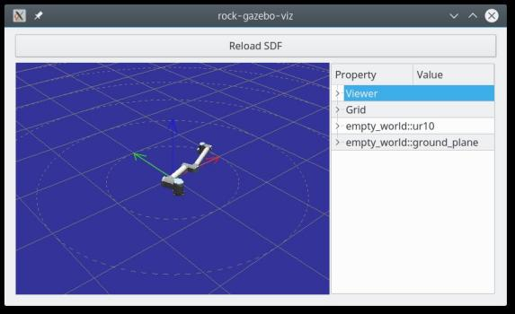

# Getting Started

We'll be getting right into the meat of things by creating a system's
integration package (a `bundle`), and setup a gazebo environment that will
allow us to continue with actually doing something with the system.

## Bundles and bundles' file structure

In Rock, the central place where the system design and integration happens is a
_bundle_. A bundle package is created in the `bundles/` folder of your Rock
workspace.

For all intents and purposes, so far, bundles are a collection of Syskit models
(in `models/`), configuration files (in `config/`) and SDF scene (`scenes/`)
and model descriptions (`models/sdf/`).

The following assumes that you have a [bootstrapped Rock
installation](../installation.html), and that you have a terminal in which this
installation's `env.sh` file has been sourced.

Let's create a new bundle. In your Rock's workspace do

```
acd
cd bundles
syskit init syskit_basics
cd syskit_basics
```

## Robot and Scene description using SDF

The [Scene Description Format](sdformat.org) is a XML format defined by the
Gazebo developers to describe both scenes and objects in these scenes (as e.g.
robots).

What we're going to learn along this documentation is to leverage the
information present in an SDF file as possible, with the goal of having the SDF
be the authoritative information source for any information that can be
represented in it.

But for now, let's get to create ourselves a scene with a robot in it. This
will **not** describe the SDF format in details, there's a lot of
Gazebo-related documentation about that, [including a reference of the format
on sdformat.org](http://sdformat.org/spec)

SDF scenes are made of _models_. Loosely-speaking, each model represents one
object in the scene. Moreover, models can be included in scenes through the
`<include>` tags, allowing to reuse models in different scenes. In general,
your robot should at least be described in a separate model to allow you to
define different simulation scenarios.

For the purpose of this part of the documentation, we'll use Gazebo's UR10 arm
model as our robot.

Usually, the first scene one creates is an empty one, which later will give us
a basic environment in which to test basic functionality, without having to care
about collisions.

In the bundles, scenes are saved in `scenes/SCENE_NAME/SCENE_NAME.world`, e.g.
`scenes/empty_world/empty_world.world`:

~~~xml
<?xml version="1.0"?>
<sdf version="1.6">
  <world name="empty_world">
    <include>
      <name>ur10</name>
      <uri>model://ur10</uri>
    </include>
    <include>
      <uri>model://ground_plane</uri>
    </include>
  </world>
</sdf>
~~~

**Note** the rock-gazebo integration does not know yet how to download models
from Gazebo's model repository. Run `rock-gazebo` on this scene once first to
make sure the models are downloaded. Wait for the scene to show up (Gazebo's
splash screen disappears then), and quit it then.
{: .warning}

## Running and visualizing a Gazebo environment

Rock offers `vizkit3d`, its own 3D visualization environment. Since we will
definitely want to augment the visualization of the world with e.g. algorithm
feedback and/or sensor data, we'll be using this environment for the Gazebo
world as well, instead of using Gazebo's client.

The Gazebo instance and visualizations are started separately. Gazebo-related
tools automatically find scenes in the bundle's `scenes/` folder, so just the
world name is enough:

```
rock-gzserver empty_world
```

Then start the visualization

```
rock-gazebo-viz empty_world
```

You're should be looking at the UR10 on the floor:



Let's go and [do something with it](arm_control.html)
